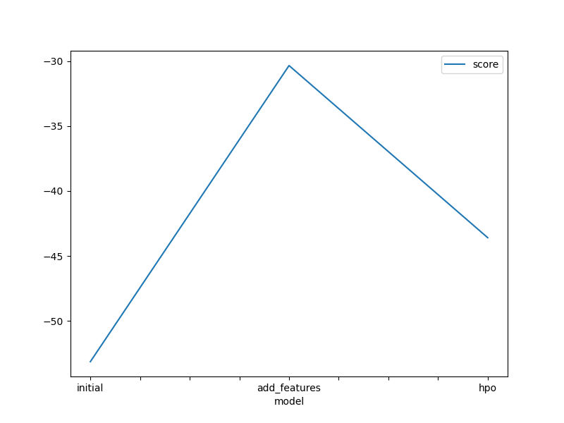
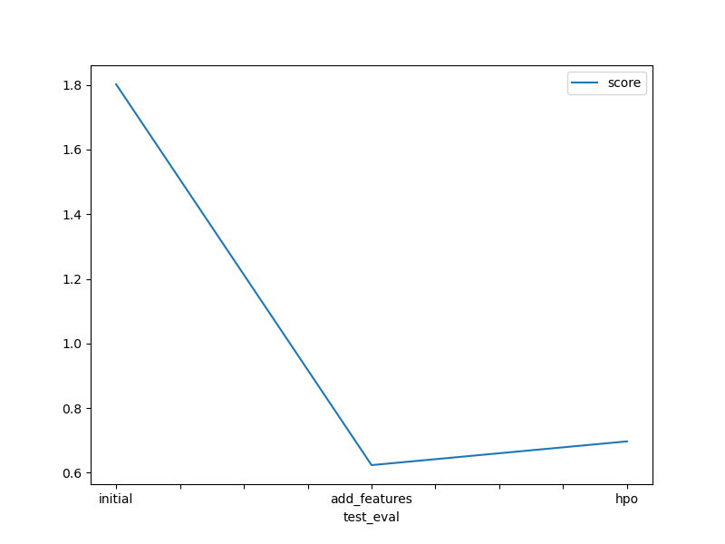

# Report: Predict Bike Sharing Demand with AutoGluon Solution
#### Muhammad Hassan

## Initial Training
### What did you realize when you tried to submit your predictions? What changes were needed to the output of the predictor to submit your results?
I've found that tweaking both features and hyperparameters significantly improves model performance compared to relying solely on AutoGluon defaults. To comply with Kaggle's requirements, I need to ensure all negative predictions are set to zero.

### What was the top ranked model that performed?
The optimal model is WeightedEnsemble_L3 with new feature only with score 0.62361 

## Exploratory data analysis and feature creation
### What did the exploratory analysis find and how did you add additional features?
The data showed significant irregularities, requiring extensive feature engineering. For example, holiday and working day distributions were skewed, while weather conditions and wind speed exhibited imbalances. Despite this, certain features like season were uniformly distributed. Additionally, temperature-related features were normally distributed. To enhance the dataset, I added the hour feature extracted from datetime and I also converted the "season" and "weather" columns to the category type.

### How much better did your model preform after adding additional features and why do you think that is?
The model's score improved from 1.8017 to 0.62361 after adding additional features. I believe this improvement occurred because the new features provided more relevant information to the model, and they were nearly uniformly distributed, indicating their effectiveness.

## Hyper parameter tuning
### How much better did your model preform after trying different hyper parameters?
The model score remained almost unchanged with the addition of new hyperparameters, shifting only from 0.62361 to 0.69705. Despite this minor increase, it still marks a substantial improvement from the initial score of 1.8017. 

### If you were given more time with this dataset, where do you think you would spend more time?
I think applying feature engineering and tuning hyperparameters.

### Create a table with the models you ran, the hyperparameters modified, and the kaggle score.
|model|hpo1|hpo2|hpo3|hpo4|score|
|--|--|--|--|--|--|
|initial|autogluon hyperparameters|autogluon hyperparameters|autogluon hyperparameters|autogluon hyperparameters|1.8017|
|add_features|autogluon hyperparameters|autogluon hyperparameters|autogluon hyperparameters|autogluon hyperparameters|0.62361|
|hpo|tune.choice([adamw, sgd, adam])| tune.choice([20, 30])|tune.uniform(0.00005, 0.1)|tune.choice([swin_base_patch4_window7_224, convnext_base_in22ft1k])|0.69705|

### Create a line plot showing the top model score for the three (or more) training runs during the project.

### Create a line plot showing the top kaggle score for the three (or more) prediction submissions during the project.

## Summary
First, I downloaded the data using Kaggle CLI and parsed the datetime column. Then, I trained my model using AutoGluon with default settings, achieving an RMSE score of 1.8017, which was unsatisfactory. Next, I conducted exploratory data analysis, created a new feature representing hours, and retrained the model, improving the score significantly compared to the initial attempt. Lastly, I tuned hyperparameters, but it didn't yield further improvement beyond the new feature alone.